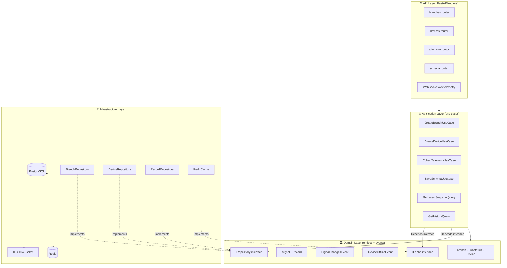
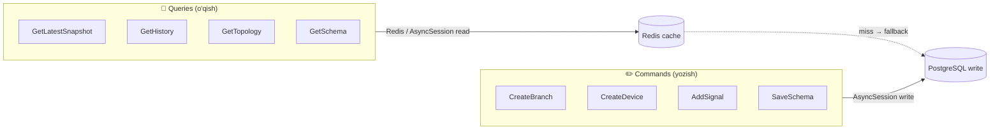

# Clean Architecture — Backend qatlam dizayni

> [!INFO] Qaror
> Backend **Clean Architecture** 4 qatlami asosida quriladi.  
> Tashqi bog'liqliklar (DB, IEC104, FastAPI) faqat tashqi qatlamda.

---

## Qatlam diagrammasi



> [!WARNING] Asosiy qoida
> `APP` qatlami `INFRA` ni **to'g'ridan-to'g'ri import qilmaydi**.  
> Faqat `DOMAIN/interfaces/` dagi abstract class (interface) orqali gaplashadi.  
> `INFRA` bu interfacelarni implement qiladi — bog'liqlik yo'nalishi ichkariga qaragan.

---

## Qatlam qoidalari

| Qatlam | Ruxsat | Taqiq |
|--------|--------|-------|
| **Domain** | Faqat Python + dataclass/pydantic | Import: FastAPI, SQLAlchemy, requests — YO'Q |
| **Application** | Domain + Interfaces | Bevosita DB, socket — YO'Q |
| **Infrastructure** | Hamma narsa | Domain logikasi — YO'Q |
| **API** | Application use cases chaqirish | Bevosita DB — YO'Q |

---

## Papka tuzilmasi

```
backend/app/
├── domain/
│   ├── entities/
│   │   ├── branch.py        # Branch, Substation dataclass
│   │   ├── device.py        # Device, DeviceSignal dataclass
│   │   └── record.py        # Record, SignalValue dataclass
│   ├── events/
│   │   ├── signal_events.py # SignalChangedEvent, DeviceOfflineEvent
│   │   └── base.py          # DomainEvent base
│   └── interfaces/
│       ├── repositories.py  # ABCRepository interfaces
│       └── cache.py         # ITelemetryCache interface
│
├── application/
│   ├── commands/            # CUD (Create/Update/Delete)
│   │   ├── branch.py
│   │   ├── device.py
│   │   └── schema.py
│   ├── queries/             # Read (CQRS Q tomon)
│   │   ├── telemetry.py     # GetLatest, GetHistory
│   │   └── topology.py      # GetBranches, GetDevices
│   └── services/
│       └── collector.py     # CollectorService (orchestrator)
│
├── infrastructure/
│   ├── db/
│   │   ├── models.py        # SQLAlchemy ORM modellari
│   │   ├── repositories.py  # Repository implementatsiyalar
│   │   ├── session.py       # SessionLocal, get_db
│   │   └── migrations/      # Alembic
│   ├── cache/
│   │   └── redis_cache.py   # Redis TelemetryCache
│   └── iec104/
│       ├── client.py        # Socket + APDU
│       ├── parser.py        # ASDU parser
│       └── state_machine.py # Connection state machine
│
└── api/
    ├── routers/
    │   ├── branches.py
    │   ├── substations.py
    │   ├── devices.py
    │   ├── telemetry.py
    │   └── schema.py
    ├── websocket/
    │   └── telemetry_ws.py  # WebSocket endpoint
    ├── dependencies.py      # FastAPI Depends()
    └── main.py
```

---

## Repository Pattern

```python
# domain/interfaces/repositories.py
from abc import ABC, abstractmethod
from typing import Generic, TypeVar, Optional
T = TypeVar("T")

class IRepository(ABC, Generic[T]):
    @abstractmethod
    async def get(self, id: int) -> Optional[T]: ...

    @abstractmethod
    async def list(self, **filters) -> list[T]: ...

    @abstractmethod
    async def create(self, entity: T) -> T: ...

    @abstractmethod
    async def update(self, entity: T) -> T: ...

    @abstractmethod
    async def delete(self, id: int) -> None: ...


class IDeviceRepository(IRepository["Device"]):
    @abstractmethod
    async def list_by_substation(self, substation_id: int) -> list["Device"]: ...

    @abstractmethod
    async def get_with_signals(self, device_id: int) -> Optional["Device"]: ...
```

```python
# infrastructure/db/repositories.py
class DeviceRepository(IDeviceRepository):
    def __init__(self, session: AsyncSession):
        self._session = session

    async def get_with_signals(self, device_id: int) -> Optional[Device]:
        result = await self._session.execute(
            select(DeviceModel)
            .options(selectinload(DeviceModel.signals))
            .where(DeviceModel.id == device_id)
        )
        row = result.scalar_one_or_none()
        return _to_domain(row) if row else None
```

---

## CQRS — Command/Query ajratish



> [!TIP] CQRS afzalligi
> Query modellari Write modeliga bog'liq emas.  
> `GetLatestSnapshot` Redis dan o'qiydi — DB ga yuklanmaydi.

---

## Unit of Work

```python
# application/unit_of_work.py
class UnitOfWork:
    def __init__(self, session_factory):
        self._factory = session_factory

    async def __aenter__(self):
        self._session = self._factory()
        self.branches = BranchRepository(self._session)
        self.devices = DeviceRepository(self._session)
        self.records = RecordRepository(self._session)
        return self

    async def __aexit__(self, *args):
        if args[0]:
            await self._session.rollback()
        else:
            await self._session.commit()
        await self._session.close()

# Ishlatilishi:
async with UnitOfWork(session_factory) as uow:
    device = await uow.devices.get_with_signals(device_id)
    await uow.records.create(Record(...))
    # commit avtomatik
```

---

## Bog'liq
- [[ADR/ADR-001 Clean Architecture]]
- [[Architecture/Data Flow]]
- [[Technical/FastAPI Patterns]]
