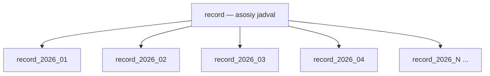
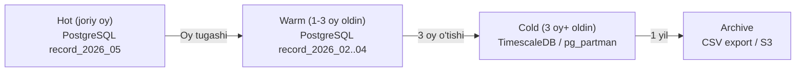

# DB Strategy — Ma'lumotlar bazasi strategiyasi

---

## Migratsiya: Alembic

```
infrastructure/db/
├── migrations/
│   ├── env.py
│   ├── script.py.mako
│   └── versions/
│       ├── 001_initial_topology.py
│       ├── 002_device_signals.py
│       ├── 003_substation_schema.py
│       └── 004_record_partitioning.py
├── models.py
└── session.py
```

```python
# Yangi migratsiya yaratish:
alembic revision --autogenerate -m "add_substation_schema"

# Qo'llash:
alembic upgrade head

# Orqaga qaytish:
alembic downgrade -1
```

> [!WARNING] Qoida
> Hech qachon `models.py` ni to'g'ridan-to'g'ri o'zgartirib, migratsiysiz ishlatma.  
> Har bir DB o'zgarishi = yangi Alembic revision.

---

## Record jadvali — Partitioning



```sql
-- Oy bo'yicha range partitioning
CREATE TABLE record (
    id          BIGSERIAL,
    device_id   INT       NOT NULL,
    signal_name VARCHAR(64) NOT NULL,
    value       FLOAT     NOT NULL,
    quality     SMALLINT  DEFAULT 0,
    captured_at TIMESTAMPTZ NOT NULL
) PARTITION BY RANGE (captured_at);

-- Har oy avtomatik partition yaratuvchi funksiya:
CREATE OR REPLACE FUNCTION create_monthly_partition(target_date DATE)
RETURNS VOID AS $$
DECLARE
    partition_name TEXT;
    start_date DATE;
    end_date DATE;
BEGIN
    partition_name := 'record_' || to_char(target_date, 'YYYY_MM');
    start_date := date_trunc('month', target_date);
    end_date := start_date + INTERVAL '1 month';
    EXECUTE format(
        'CREATE TABLE IF NOT EXISTS %I
         PARTITION OF record
         FOR VALUES FROM (%L) TO (%L)',
        partition_name, start_date, end_date
    );
END;
$$ LANGUAGE plpgsql;
```

### Partitioning afzalliklari
| Muammo | Partitionsiz | Partitioning bilan |
|--------|-------------|---------------------|
| 1 yillik so'rov | Full scan (12M row) | Faqat 1-2 partition |
| O'chirish | DELETE slow | DROP PARTITION (instant) |
| Indeks o'lchami | Katta | Har partition alohida |

---

## Muhim indekslar

```sql
-- Record so'rovlar uchun
CREATE INDEX idx_record_device_signal_time
    ON record(device_id, signal_name, captured_at DESC);

-- Tarix so'rovlar uchun (vaqt oraliq)
CREATE INDEX idx_record_time_brin
    ON record USING brin(captured_at)
    WITH (pages_per_range = 128);

-- Topologiya so'rovlar
CREATE INDEX idx_device_substation ON device(substation_id);
CREATE INDEX idx_substation_branch ON substation(branch_id);

-- Signal lookup (collector uchun)
CREATE UNIQUE INDEX idx_device_signal_unique
    ON device_signal(device_id, register_code);
```

---

## Async SQLAlchemy (AsyncSession)

```python
# infrastructure/db/session.py
from sqlalchemy.ext.asyncio import AsyncSession, create_async_engine, async_sessionmaker

engine = create_async_engine(
    settings.database_url,       # postgresql+asyncpg://...
    pool_size=10,
    max_overflow=20,
    pool_pre_ping=True,          # ulanish tirikligini tekshiradi
    pool_recycle=3600,           # 1 soatda ulanishni yangilash
    echo=settings.debug,
)

AsyncSessionLocal = async_sessionmaker(
    engine,
    class_=AsyncSession,
    expire_on_commit=False,      # commit dan keyin attribute lazy load yo'q
)

async def get_db() -> AsyncGenerator[AsyncSession, None]:
    async with AsyncSessionLocal() as session:
        try:
            yield session
        except Exception:
            await session.rollback()
            raise
```

---

## Connection pool monitoring

```python
# api/routers/health.py — pool holati ko'rsatish
@router.get("/health/db")
async def db_health():
    pool = engine.pool
    return {
        "pool_size":      pool.size(),
        "checked_in":     pool.checkedin(),
        "checked_out":    pool.checkedout(),
        "overflow":       pool.overflow(),
        "invalid":        pool.invalid(),
    }
```

---

## Record arxivlash strategiyasi



> [!NOTE] Hozircha
> Arxivlash hozircha shart emas. Partitioning yetarli.  
> 1 yildan so'ng `DROP TABLE record_2025_*` — instant.

---

## Bog'liq
- [[02 - DB Sxema]]
- [[Architecture/Clean Architecture]]
- [[features/F08 - History Recording]]
