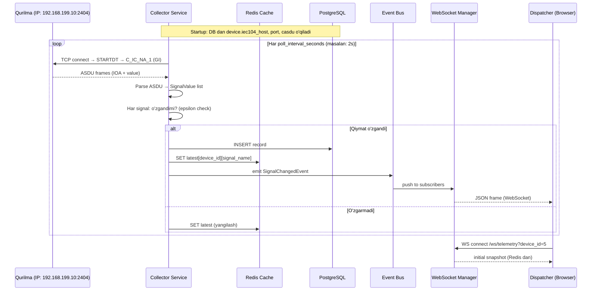
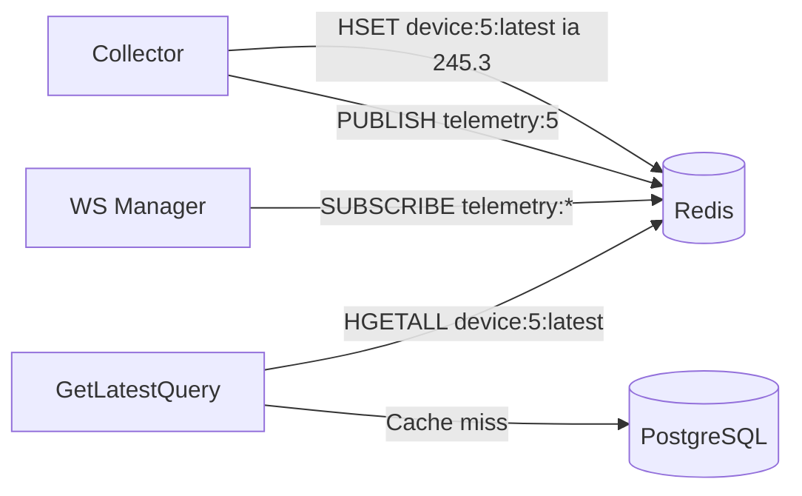
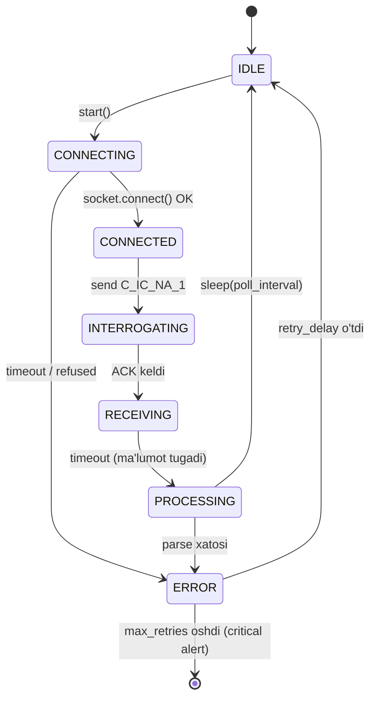

# Data Flow — Ma'lumot oqimi va Event-Driven dizayn

---

## Umumiy oqim



---

## Domain Events

```python
# domain/events/signal_events.py
from dataclasses import dataclass, field
from datetime import datetime

@dataclass(frozen=True)
class DomainEvent:
    occurred_at: datetime = field(default_factory=datetime.utcnow)

@dataclass(frozen=True)
class SignalChangedEvent(DomainEvent):
    device_id:   int
    signal_name: str
    old_value:   float | None
    new_value:   float
    unit:        str
    quality:     int

@dataclass(frozen=True)
class DeviceOfflineEvent(DomainEvent):
    device_id: int
    reason:    str

@dataclass(frozen=True)
class DeviceOnlineEvent(DomainEvent):
    device_id:    int
    points_count: int
```

---

## Event Bus (in-process)

```python
# infrastructure/events/bus.py
from collections import defaultdict
from typing import Callable, Awaitable

Handler = Callable[[DomainEvent], Awaitable[None]]

class EventBus:
    def __init__(self):
        self._handlers: dict[type, list[Handler]] = defaultdict(list)

    def subscribe(self, event_type: type, handler: Handler):
        self._handlers[event_type].append(handler)

    async def publish(self, event: DomainEvent):
        for handler in self._handlers[type(event)]:
            await handler(event)

# Startup da:
bus = EventBus()
bus.subscribe(SignalChangedEvent, ws_manager.broadcast_signal)
bus.subscribe(SignalChangedEvent, record_writer.on_signal_change)
bus.subscribe(DeviceOfflineEvent, ws_manager.broadcast_offline)
```

---

## Redis Cache strategiyasi



### Redis key sxemasi
```
device:{id}:latest   HASH    {signal_name → JSON(value,unit,quality,ts)}
device:{id}:status   HASH    {online, message, updated_at}
telemetry:{id}       PubSub  channel (WS Manager subscribe qiladi)
```

> [!NOTE] Tarix Redis da saqlanmaydi
> `record` tarixini Redis ZSET da kesh qilish keraksiz murakkablik.  
> `GET /api/telemetry/history` — **doim PostgreSQL** (partitioned) dan o'qiydi.  
> Redis faqat **oxirgi qiymat** va **WS pub/sub** uchun.

### TTL strategiyasi
```
device:{id}:latest  →  TTL = poll_interval × 5  (10 soniya)
device:{id}:status  →  TTL = 60 soniya
```

---

## Collector holat mashina (State Machine)



```python
# infrastructure/iec104/state_machine.py
from enum import Enum, auto

class CollectorState(Enum):
    IDLE         = auto()
    CONNECTING   = auto()
    CONNECTED    = auto()
    INTERROGATING= auto()
    RECEIVING    = auto()
    PROCESSING   = auto()
    ERROR        = auto()
```

---

## Xato boshqaruv strategiyasi

```python
# application/services/collector.py
RETRY_DELAYS = [2, 5, 10, 30, 60]  # eksponensial backoff

async def collector_loop(device: Device, bus: EventBus):
    retry_count = 0
    while True:
        try:
            rows = await collect_once(device)
            retry_count = 0  # muvaffaqiyatda reset
            for row in rows:
                await bus.publish(SignalChangedEvent(...))
        except ConnectionRefusedError:
            delay = RETRY_DELAYS[min(retry_count, len(RETRY_DELAYS)-1)]
            retry_count += 1
            await bus.publish(DeviceOfflineEvent(device.id, "connection refused"))
            await asyncio.sleep(delay)
        except Exception as exc:
            log.exception(f"device {device.id} collector error")
            await asyncio.sleep(RETRY_DELAYS[0])
```

---

## Bog'liq
- [[Architecture/WebSocket Strategy]]
- [[Architecture/Clean Architecture]]
- [[Technical/IEC104 Deep Dive]]
- [[Technical/Collector Design]]
