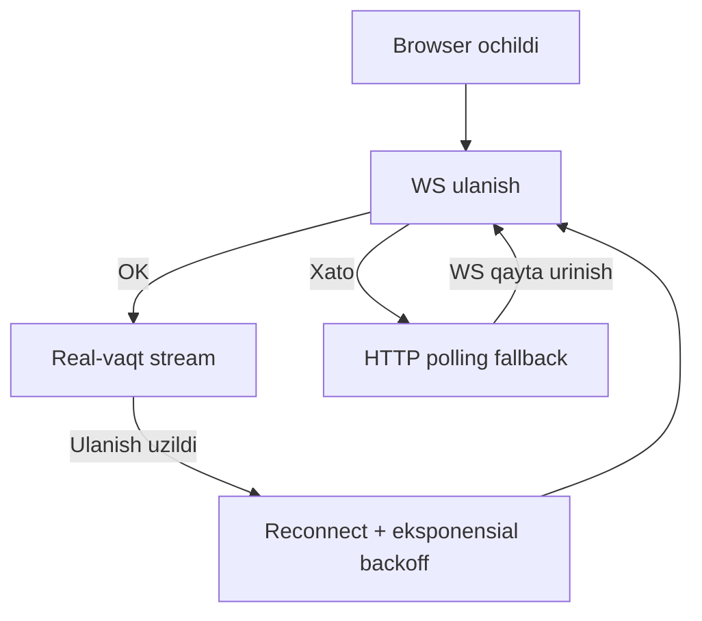

# WebSocket Strategy — Real-vaqt strategiyasi

> [!SUCCESS] Qaror: WebSocket
> Dispatcher uchun polling (har 2 soniya HTTP) o'rniga **WebSocket** ishlatiladi.  
> Sabab → [[ADR/ADR-002 WebSocket vs Polling]]

---

## Polling vs WebSocket taqqoslash

| Mezon | HTTP Polling (2s) | WebSocket |
|-------|-------------------|-----------|
| Kechikish | ~2 soniya | ~10-50 ms |
| Server yuki | Yuqori (har client = har 2s request) | Past (doimiy ulanish) |
| Tarmoq traffik | Ko'p (headers qayta-qayta) | Minimal |
| Murakkablik | Oddiy | O'rtacha |
| Reconnect | Avtomatik | Kerak bo'ladi |

---

## FastAPI WebSocket arxitekturasi

```python
# api/websocket/telemetry_ws.py
from fastapi import WebSocket, WebSocketDisconnect
from typing import Optional
import asyncio, json

class ConnectionManager:
    def __init__(self):
        # device_id → set of WebSocket connections
        self._subs: dict[int | None, set[WebSocket]] = {}
        self._lock = asyncio.Lock()

    async def connect(self, ws: WebSocket, device_id: Optional[int]):
        await ws.accept()
        async with self._lock:
            self._subs.setdefault(device_id, set()).add(ws)
        # Initial snapshot yuborish
        snapshot = await cache.get_snapshot(device_id)
        await ws.send_json({"type": "snapshot", "data": snapshot})

    async def disconnect(self, ws: WebSocket, device_id: Optional[int]):
        async with self._lock:
            self._subs.get(device_id, set()).discard(ws)

    async def broadcast_signal(self, event: SignalChangedEvent):
        frame = {
            "type": "signal",
            "device_id": event.device_id,
            "signal_name": event.signal_name,
            "value": event.new_value,
            "unit": event.unit,
            "quality": event.quality,
            "ts": event.occurred_at.isoformat(),
        }
        # Device ga subscribe qilganlar + barcha (None) ko'ruvchilar
        targets: set[tuple[WebSocket, int | None]] = set()
        for ws in self._subs.get(event.device_id, set()):
            targets.add((ws, event.device_id))
        for ws in self._subs.get(None, set()):
            targets.add((ws, None))

        dead: list[tuple[WebSocket, int | None]] = []
        for ws, sub_key in targets:
            try:
                await ws.send_json(frame)
            except Exception:
                dead.append((ws, sub_key))
        # Har WS o'zining haqiqiy subscription key bilan o'chiriladi
        for ws, sub_key in dead:
            await self.disconnect(ws, sub_key)

manager = ConnectionManager()


# Endpoint:
@router.websocket("/ws/telemetry")
async def ws_telemetry(ws: WebSocket, device_id: Optional[int] = None):
    await manager.connect(ws, device_id)
    try:
        while True:
            # Ping/pong — ulanish tirik
            await asyncio.wait_for(ws.receive_text(), timeout=30)
    except (WebSocketDisconnect, asyncio.TimeoutError):
        await manager.disconnect(ws, device_id)
```

---

## Frontend WebSocket hook

```typescript
// hooks/useTelemetrySocket.ts
import { useEffect, useRef, useCallback } from "react";
import { useQueryClient } from "@tanstack/react-query";

const WS_URL = import.meta.env.VITE_WS_URL ?? "ws://localhost:8000";
const RECONNECT_DELAYS = [1000, 2000, 5000, 10000, 30000];

export function useTelemetrySocket(deviceId?: number) {
  const qc = useQueryClient();
  const wsRef = useRef<WebSocket | null>(null);
  const retryRef = useRef(0);
  const mountedRef = useRef(true);

  const connect = useCallback(() => {
    const url = deviceId
      ? `${WS_URL}/ws/telemetry?device_id=${deviceId}`
      : `${WS_URL}/ws/telemetry`;

    const ws = new WebSocket(url);
    wsRef.current = ws;

    ws.onopen = () => { retryRef.current = 0; };

    ws.onmessage = (e) => {
      const msg = JSON.parse(e.data);

      if (msg.type === "snapshot") {
        // TanStack Query cache ni to'g'ridan-to'g'ri yangilash
        qc.setQueryData(["telemetry", "latest", deviceId], msg.data);
      }

      if (msg.type === "signal") {
        // Optimistic update — HTTP so'rovsiz
        qc.setQueryData(
          ["telemetry", "latest", msg.device_id],
          (old: any) => old
            ? { ...old, latest: old.latest.map((s: any) =>
                s.signal_name === msg.signal_name && s.device_id === msg.device_id
                  ? { ...s, value: msg.value, captured_at: msg.ts }
                  : s
              )}
            : old
        );
      }

      if (msg.type === "offline") {
        qc.setQueryData(["telemetry", "status", msg.device_id], {
          online: false, message: msg.reason
        });
      }
    };

    ws.onclose = () => {
      if (!mountedRef.current) return;
      const delay = RECONNECT_DELAYS[
        Math.min(retryRef.current++, RECONNECT_DELAYS.length - 1)
      ];
      setTimeout(connect, delay);
    };
  }, [deviceId, qc]);

  useEffect(() => {
    mountedRef.current = true;
    connect();
    return () => {
      mountedRef.current = false;
      wsRef.current?.close();
    };
  }, [connect]);
}
```

---

## Xabar protokoli (WS frames)

```typescript
// types/ws.ts
type WsFrame =
  | { type: "snapshot"; data: LiveSnapshot }
  | { type: "signal";   device_id: number; signal_name: string;
      value: number; unit: string; quality: number; ts: string }
  | { type: "offline";  device_id: number; reason: string }
  | { type: "online";   device_id: number; points_count: number }
  | { type: "pong" };
```

---

## Fallback strategiya



> [!WARNING] Fallback
> WS ulanolmasa (korporativ firewall, proxy) — HTTP polling (5s) ga tushadi.  
> `useTelemetrySocket` hook bu holatni avtomatik boshqaradi.

---

## Bog'liq
- [[ADR/ADR-002 WebSocket vs Polling]]
- [[Architecture/Data Flow]]
- [[Technical/FastAPI Patterns]]
