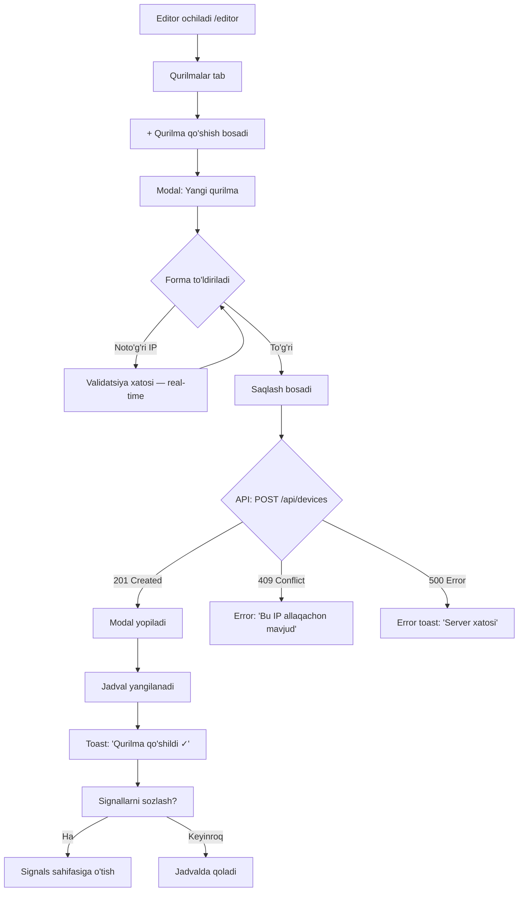

# Editor — Foydalanuvchi Oqimlari (User Flows)

**Foydalanuvchi**: Admin texnik mutaxassis — tizimni sozlash, qurilmalar qo'shish.

---

## Persona: Admin Texnik

```
Ism:     Dilshod
Rol:     Tizim administratori / IEC104 mutaxassis
Maqsad:  Yangi qurilma qo'shish va signallarini sozlash
         Podstansiya sxemasini chizish
         Qurilmalar ro'yxatini boshqarish
Texnik:  IEC104 protokolini biladi (IOA, CASDU)
Qurilma: Ish stoli kompyuteri (1440×900+)
```

---

## Flow 1 — Yangi qurilma qo'shish (asosiy flow)



---

## Flow 2 — Signal konfiguratsiya (F05)

```
Admin → Devices jadvalida "BMRZ-153 №1" qatorida [📡 Signallar] bosadi
      → URL: /editor/devices/5/signals
      → Device sarlavhasi: "BMRZ-153 №1 · 192.168.199.10:2404"
      → Signal jadval chiqadi (bo'sh bo'lishi mumkin)
      → [+ Signal qo'shish] bosadi
      → Modal:
          IOA:          [1000    ]  ← register_code, required, number
          Signal Name:  [Ia      ]  ← mashinacha nom, required
          Title:        [Tok A fazasi]  ← odam uchun nom
          Unit:         [A       ]  ← birlik
          Type:         [float ▼]  ← float / status
      → [Saqlash]
      → POST /api/devices/5/signals
      → Signal jadvalga qo'shiladi

Admin 5 ta signal qo'shadi
      → Collector shu IOA larni qurilmadan o'qiydi
```

---

## Flow 3 — Sxema chizish (F06)

```
Admin → Substations jadvalida "Yunusobod PS" → [Sxema] bosadi
      → URL: /editor/substations/3/schema
      → React Flow canvas ochiladi
      → GET /api/substations/3/schema → canvas_json yuklash
          (bo'sh bo'lsa: fitView yoq, blank canvas)

Admin → Toolbar: [+ Node qo'shish] bosadi
      → Dropdown: [Relay] [Transformer] [Switch] [Meter] [Bus] [Label]
      → "Relay" tanlanadi
      → Canvas markaziga yangi node qo'shiladi
      → Properties panel: Label, Device select, Color

Admin → Node ni sudrab joyiga qo'yadi
Admin → Yana bir node qo'shadi: "Bus 110kV"
Admin → Relay node dan Bus ga chiziq tortadi (edge)
      → Handle dan handle ga tortish

Admin → [Saqlash] bosadi
      → PUT /api/substations/3/schema { canvas_json: {...} }
      → Toast: "Sxema saqlandi ✓"
      → Dispatcher darhol yangi sxemani ko'radi
```

---

## Flow 4 — Qurilmani tahrirlash (IP o'zgartirish)

```
Admin → Devices jadvalida [✏] bosadi
      → Modal: "Qurilmani tahrirlash" (BMRZ-153 №1)
      → Barcha maydonlar to'ldirilgan (pre-filled)
      → IP ni o'zgartiradi: 192.168.199.10 → 192.168.199.15
      → [Saqlash]
      → PUT /api/devices/5
      → Collector AVTOMATIK yangi IP ga ulanadi
         (CollectorManager.remove_device → add_device)
      → Toast: "O'zgarishlar saqlandi ✓"
```

---

## Flow 5 — Qurilmani o'chirish

```
Admin → [🗑] bosadi
      → Tasdiqlash modali:
        "BMRZ-153 №1 ni o'chirmoqchimisiz?
         Bu qurilmaning 1,234 ta yozuvi ham o'chib ketadi.
         Bu amalni bekor qilib bo'lmaydi."
        [Bekor qilish]  [Ha, o'chirish]  ← danger button

Admin → [Ha, o'chirish]
      → DELETE /api/devices/5
      → Qurilma jadvaldan yo'qoladi
      → Toast: "Qurilma o'chirildi"
      → Collector task to'xtatiladi
```

---

## Flow 6 — Branch → Substation ierarxiyasi

```
Admin → Filiallar tab → [+ Filial qo'shish]
      → POST /api/branches { name: "Yunusobod filiali" }
      → Filial yaratildi

Admin → Podstansiyalar tab
      → [+ Podstansiya qo'shish]
      → Modal: Nomi + Filial (select: "Yunusobod filiali")
      → POST /api/substations { name: "Yunusobod PS", branch_id: 1 }
      → Podstansiya yaratildi

Admin → Qurilmalar tab
      → [+ Qurilma qo'shish]
      → Modal: Nomi + Podstansiya (select: "Yunusobod PS") + IP + ...
      → POST /api/devices { substation_id: 1, iec104_host: "192.168.199.10", ... }
```

---

## Flow 7 — Model Katalogi (F04)

```
Admin → Model Katalogi tab
      → Ro'yxat: [BMRZ-153, SIPROTEC-7SJ85, ...]
      → [+ Model qo'shish]
      → Modal: Model nomi + Ishlab chiqaruvchi + Tavsif
      → POST /api/models { name: "BMRZ-153", manufacturer: "EKRA", ... }
      → Yangi model Qurilma qo'shish formida paydo bo'ladi
```

---

## Xato holatlari

| Xato | Ko'rinish | Admin imkoniyati |
|------|-----------|-----------------|
| Form validation | Field ostida qizil matn | To'g'irlaydi |
| 409 Conflict (UNIQUE) | Modal ichida error banner | Boshqa qiymat kiritadi |
| 404 Not Found | Sahifa: "Qurilma topilmadi" | Ortga ketadi |
| Network xato | Toast: "Internet yo'q yoki server ishlamayapti" | Keyinroq urinadi |
| Canvas saqlanmadi | Schema Editor toolbar da sariq indikator | [Qayta saqlash] bosadi |

---

## Bog'liq
- [[Design/editor/UX/Wireframes]]
- [[Design/editor/UX/Interaction Patterns]]
- [[features/F01 - Branch Management]]
- [[features/F03 - Device Management]]
- [[features/F06 - Schema Editor]]
