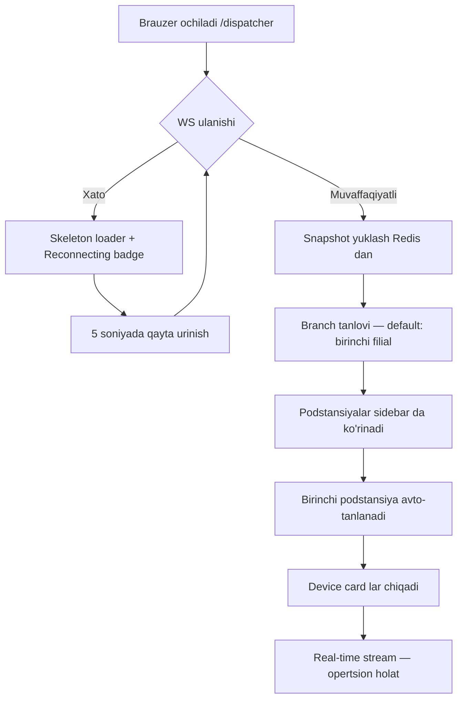

# Dispatcher — Foydalanuvchi Oqimlari (User Flows)

**Foydalanuvchi**: Dispetcher operator — real-time monitoring, read-only.

---

## Persona: Dispetcher Operator

```
Ism:     Sherzod
Rol:     Yunusobod filiali nazoratchi operatori
Maqsad:  Barcha qurilmalar onlayn ekanligini kuzatish
         Signal qiymatlarini real vaqtda ko'rish
         Tarixiy o'zgarishlarni tekshirish
Qo'rquv: Qurilma oflayn bo'lib qolsa va u bilmasa
         Ma'lumot eskirib qolsa (stale data)
Qurilma: Boshqaruv xonasi monitori (1920×1080, dark room)
```

---

## Flow 1 — Ilovani ochish va dastlabki holat



**Muhim**: WS ulanishi muvaffaqiyatli bo'lgach **snapshot** (Redis dan barcha oxirgi qiymatlar) birinchi xabar sifatida keladi. Operator sahifani yangilamasdan hozirgi holatni ko'radi.

---

## Flow 2 — Podstansiya tanlash

```
Operator → Sidebar da "Chilonzor PS" bosadi
         → URL o'zgaradi: /dispatcher/substation/3
         → Sahifa skroll tepaga qaytadi
         → Header yangilanadi: "Chilonzor PS · 8/10 online"
         → Device card lar animatsiya bilan almashinadi
         → WS subscription o'zgarmaydi (barcha devicelar saqlanadi)
```

**Sidebar state:**
```
Barcha podstansiyalar ko'rinadi
Aktiv bo'lmagan: oddiy matn
Aktiv:           chapda ko'k chiziq, rang ajratilgan
Offline device bor: sariq nuqta podstansiya nomi yonida
```

---

## Flow 3 — Signal o'zgarishini kuzatish (Real-time)

```
WebSocket dan SignalChangedEvent keladi
↓
Mos device_id va signal_name topiladi (Zustand store)
↓
Qiymat yangilanadi
↓
SignalRow 1.2 soniya davomida ko'k fon bilan yonadi (flash)
↓
"Yangilandi: 14:32:05" timestamp yangilanadi
↓
Agar qurilma offline → StatusBadge qizilga o'tadi + DeviceCard border qizil
```

---

## Flow 4 — Qurilma oflayn bo'lganda

```
DeviceOfflineEvent (WS) keladi
↓
DeviceCard holati: OFFLINE
StatusBadge: ● Offline (qizil, pulsatsiya yo'q)
Signal qiymatlari: "—" bilan o'zgartirilmaydi (oxirgi qiymat saqlanadi)
Border: 1px solid #F85149
↓
Operator yuziga qaraydi: nima bo'ldi?
Operator mouse hover qiladi card ustida
↓
Tooltip: "Uzilgan sababi: Connection refused (192.168.199.10:2404)"
Vaqt: "14:29:11 dan beri oflayn (3 daqiqa)"
↓
Operator shift boshlig'iga xabar beradi
```

---

## Flow 5 — Tarix ko'rish

```
Operator → Signal ustiga bosadi (click)
         → Yan panel (right drawer) ochiladi (w: 480px)
         → "Ia — Tok A fazasi" sarlavhasi
         → Sana/vaqt tanlagich: [Dan: ] [Gacha: ] [Ko'rsatish]
         → Standart: oxirgi 1 soat

Operator "Ko'rsatish" bosadi
         → GET /api/telemetry/history?device_id=5&signal_name=Ia&from=...&to=...
         → LineChart (stepAfter type) chiqadi
         → Jadval: vaqt | qiymat | sifat
         → "Export CSV" tugmasi
```

---

## Flow 6 — Sxema ko'rish

```
Operator → Podstansiya sarlavhasidagi "Sxema" ikonasi bosadi
         → URL: /dispatcher/substation/3/schema
         → React Flow (read-only) ochiladi
         → fitView: barcha nodelar ko'rinadi
         → Har bir device node ustida hover → signal popup
         → Pinch/zoom bilan kattalashtirish
         → "Orqaga" → podstansiya monitoring sahifasiga
```

---

## Flow 7 — Filial almashish

```
TopBar → "Yunusobod filiali" dropdown bosadi
       → Barcha filiallar ro'yxati chiqadi
       → "Chilonzor filiali" tanlanadi
       → Sidebar: bu filialdagi podstansiyalar
       → Birinchi podstansiya avto-tanlanadi
       → WS subscription o'zgarmaydi (global stream)
```

---

## Xato holatlari

| Xato | Ko'rinish | Operator imkoniyati |
|------|-----------|---------------------|
| WS uzildi | TopBar: ● Uzilgan (qizil), auto-reconnect | Kutadi |
| HTTP 404 | Empty state: "Podstansiya topilmadi" | Sidebar dan boshqa tanlaydi |
| HTTP 500 | Toast: "Server xatosi. Sahifani yangilang" | F5 |
| Barcha devices offline | SubstationHeader: 0/N online (qizil) | Muammoni aniqlaydi |
| Stale data (TTL) | Qiymat rangi kulrang, "[Eskirgan]" label | — |

---

## Bog'liq
- [[Design/frontend/UX/Wireframes]]
- [[Design/frontend/UX/Interaction Patterns]]
- [[features/F07 - Dispatcher View]]
- [[Architecture/WebSocket Strategy]]
