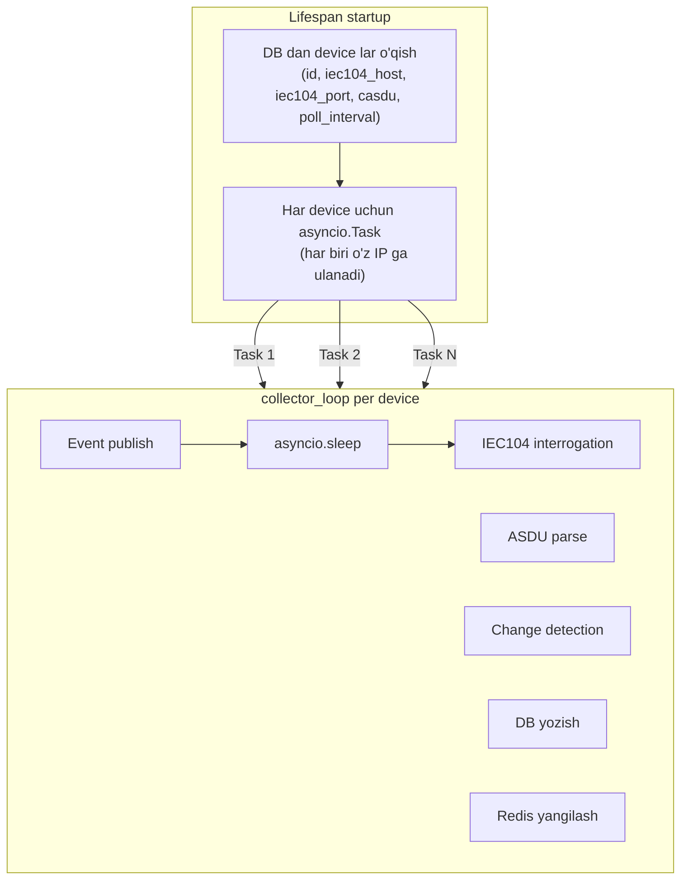

# Collector Design — Background task dizayni

---

## Arxitektura



---

## CollectorService

```python
# application/services/collector.py
import asyncio
import logging
from dataclasses import dataclass, field

from ...domain.entities.device import Device
from ...domain.events.signal_events import SignalChangedEvent, DeviceOfflineEvent
from ...infrastructure.iec104.client import Iec104Config, read_interrogation_async
from ...infrastructure.cache.redis_cache import RedisCache
from ...infrastructure.db.repositories import RecordRepository

log = logging.getLogger(__name__)

RETRY_DELAYS = [2, 5, 10, 30, 60]
EPSILON_FLOAT = 0.001


@dataclass
class SignalCache:
    """Qurilma uchun oxirgi ma'lum qiymatlar — RAM da."""
    last: dict[str, float] = field(default_factory=dict)

    def has_changed(self, name: str, new_val: float, is_status: bool) -> bool:
        old = self.last.get(name)
        if old is None:
            return True
        if is_status:
            return old != new_val
        return abs(new_val - old) > EPSILON_FLOAT

    def update(self, name: str, val: float):
        self.last[name] = val


class CollectorService:
    def __init__(
        self,
        device: Device,
        record_repo: RecordRepository,
        cache: RedisCache,
        event_bus,
    ):
        self._device = device
        self._record_repo = record_repo
        self._cache = cache
        self._bus = event_bus
        self._signal_cache = SignalCache()
        self._retry_count = 0

    async def run_forever(self):
        while True:
            try:
                await self._poll_once()
                self._retry_count = 0
                # Muvaffaqiyatli poll → normal interval da kutish
                await asyncio.sleep(self._device.poll_interval_seconds)
            except asyncio.CancelledError:
                raise
            except Exception as exc:
                delay = RETRY_DELAYS[
                    min(self._retry_count, len(RETRY_DELAYS) - 1)
                ]
                self._retry_count += 1
                log.warning(
                    f"[device:{self._device.id}] error: {exc} "
                    f"(retry in {delay}s, attempt #{self._retry_count})"
                )
                await self._bus.publish(
                    DeviceOfflineEvent(self._device.id, str(exc))
                )
                # Xato → retry delay da kutish (poll_interval YO'Q, double sleep xatosi)
                await asyncio.sleep(delay)

    async def _poll_once(self):
        cfg = Iec104Config(
            host=self._device.iec104_host,
            port=self._device.iec104_port,
            common_address=self._device.iec104_common_address,
            # poll_interval_seconds DB dagi device.poll_interval_seconds dan keladi
        )
        raw_rows = await read_interrogation_async(cfg)

        # Signal -> device_signal lookup map (RAM da)
        signal_map = {s.register_code: s for s in self._device.signals}

        rows_to_write = []
        for row in raw_rows:
            sig = signal_map.get(row["ioa"])
            if sig is None:
                continue

            is_status = sig.value_type == "status"
            if self._signal_cache.has_changed(sig.signal_name, row["value"], is_status):
                old_val = self._signal_cache.last.get(sig.signal_name)
                self._signal_cache.update(sig.signal_name, row["value"])

                rows_to_write.append({
                    "device_id":   self._device.id,
                    "signal_name": sig.signal_name,
                    "value":       row["value"],
                    "quality":     row.get("quality", 0),
                    "captured_at": row["captured_at"],
                })

                await self._bus.publish(SignalChangedEvent(
                    device_id=self._device.id,
                    signal_name=sig.signal_name,
                    old_value=old_val,
                    new_value=row["value"],
                    unit=sig.unit,
                    quality=row.get("quality", 0),
                ))

        if rows_to_write:
            await self._record_repo.bulk_insert(rows_to_write)

        # Redis ni har holda yangilash (TTL uchun)
        await self._cache.set_device_latest(self._device.id, raw_rows, signal_map)
        await self._cache.set_device_status(
            self._device.id, online=True,
            message=f"{len(raw_rows)} points received"
        )
```

---

## Device hot-reload

```python
# Yangi device qo'shilganda collector ni qayta ishga tushirmasdan qo'shish:

class CollectorManager:
    def __init__(self, event_bus, ...):
        self._tasks: dict[int, asyncio.Task] = {}

    async def add_device(self, device: Device):
        if device.id in self._tasks:
            return
        service = CollectorService(device, ...)
        task = asyncio.create_task(
            service.run_forever(),
            name=f"collector-{device.id}"
        )
        self._tasks[device.id] = task

    async def remove_device(self, device_id: int):
        task = self._tasks.pop(device_id, None)
        if task:
            task.cancel()
            await asyncio.gather(task, return_exceptions=True)

    async def shutdown(self):
        for task in self._tasks.values():
            task.cancel()
        await asyncio.gather(*self._tasks.values(), return_exceptions=True)
```

---

## Monitoring endpoint

```python
# api/routers/health.py
@router.get("/health/collectors")
async def collector_health(manager: CollectorManager = Depends(get_manager)):
    return {
        "total": len(manager._tasks),
        "running": sum(1 for t in manager._tasks.values() if not t.done()),
        "failed":  sum(1 for t in manager._tasks.values() if t.done() and t.exception()),
    }
```

---

## Bog'liq
- [[Technical/IEC104 Deep Dive]]
- [[Architecture/Data Flow]]
- [[features/F08 - History Recording]]
