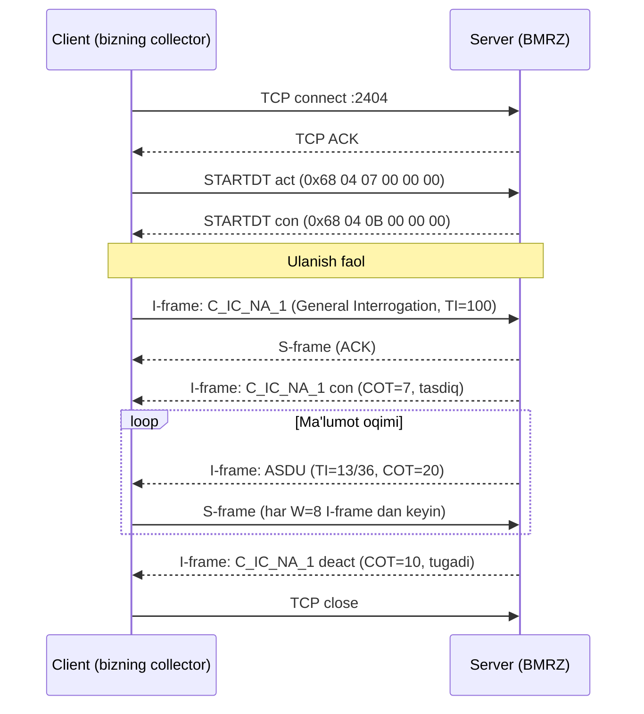

# IEC104 Deep Dive — Protokol chuqur tahlili

---

## APDU tuzilmasi

```
┌──────────────────────────────────────────────┐
│  Start byte: 0x68  │  Length (1 byte)        │
├─────────────────────────────────────────────-┤
│           Control Field (4 bytes)            │
│  CF[0] CF[1] CF[2] CF[3]                     │
├──────────────────────────────────────────────┤
│           ASDU (Application Service DU)      │
│  Type ID │ VSQ │ COT (2) │ CA (2) │ Objects  │
└──────────────────────────────────────────────┘
```

### Frame turlari (Control Field ga qarab)

| Frame | CF[0] bit0 | CF[0] bit1 | Maqsad |
|-------|------------|------------|--------|
| **I-frame** | 0 | — | Ma'lumot uzatish |
| **S-frame** | 1 | 0 | ACK (tasdiqlovchi) |
| **U-frame** | 1 | 1 | Boshqaruv (STARTDT, STOPDT, TESTFR) |

```
U-frame turlari:
  0x68 04 07 00 00 00  →  STARTDT act (ulanish boshlash)
  0x68 04 0B 00 00 00  →  STARTDT con (tasdiq)
  0x68 04 43 00 00 00  →  TESTFR act  (ping)
  0x68 04 83 00 00 00  →  TESTFR con  (pong)
```

---

## To'liq ulanish ketma-ketligi



---

## Production-ready IEC104 Client

```python
# infrastructure/iec104/client.py
import asyncio, socket, struct
from dataclasses import dataclass, field
from datetime import datetime, timedelta
from typing import AsyncIterator

_TZ = timedelta(hours=5)

@dataclass
class Iec104Config:
    host: str
    port: int = 2404
    common_address: int = 3
    connect_timeout: float = 5.0
    read_timeout: float = 8.0
    t1: float = 15.0   # ACK kutish (sekund)
    t2: float = 10.0   # S-frame yuborish oralig'i
    t3: float = 20.0   # TESTFR oralig'i
    k: int = 12        # Maksimal unconfirmed I-frames
    w: int = 8         # ACK (S-frame) bosqichi

@dataclass
class Iec104State:
    send_seq: int = 0
    recv_seq: int = 0
    unconfirmed: int = 0  # S-frame yuborilmagan I-framlar soni

class Iec104ParseError(Exception): ...
class Iec104TimeoutError(Exception): ...
class Iec104ConnectionError(Exception): ...


async def read_interrogation_async(cfg: Iec104Config) -> list[dict]:
    """
    Async wrapper — asyncio.to_thread orqali blocking socket ni chaqiradi.
    Kelajakda to'liq async socket ga o'tish uchun interface tayyor.
    """
    return await asyncio.to_thread(_read_interrogation_sync, cfg)


def _read_interrogation_sync(cfg: Iec104Config) -> list[dict]:
    state = Iec104State()
    started_at = datetime.utcnow() + _TZ

    with socket.create_connection(
        (cfg.host, cfg.port), timeout=cfg.connect_timeout
    ) as sock:
        sock.settimeout(cfg.read_timeout)

        # 1. STARTDT
        sock.sendall(bytes.fromhex("68 04 07 00 00 00"))
        _expect_startdt_con(sock)

        # 2. General Interrogation
        sock.sendall(_make_gi(state, cfg.common_address))

        # 3. Javoblarni o'qish
        rows: list[dict] = []
        while True:
            try:
                apdu = _recv_apdu(sock)
                parsed = _parse_apdu(apdu, state)
                rows.extend(parsed)

                # S-frame: har w ta I-frame dan keyin ACK
                if state.unconfirmed >= cfg.w:
                    sock.sendall(_make_s_frame(state))
                    state.unconfirmed = 0

            except socket.timeout:
                break
            except Iec104ParseError as e:
                # Parse xatosi — log va davom et
                import logging
                logging.getLogger(__name__).warning(f"Parse error: {e}")
                continue

        return [_enrich(r, started_at) for r in rows]
```

---

## ASDU Parser — Type ID qo'llab-quvvatlash

```python
# infrastructure/iec104/parser.py

PARSERS: dict[int, Callable] = {
    1:  _parse_sp,      # M_SP_NA_1  Single-point
    3:  _parse_dp,      # M_DP_NA_1  Double-point
    9:  _parse_me_na,   # M_ME_NA_1  Normalized float
    11: _parse_me_nb,   # M_ME_NB_1  Scaled integer
    13: _parse_me_nc,   # M_ME_NC_1  Short float (IEEE 754)
    30: _parse_sp_tb,   # M_SP_TB_1  SP + CP56Time2a
    31: _parse_dp_tb,   # M_DP_TB_1  DP + CP56Time2a
    34: _parse_me_td,   # M_ME_TD_1  Normalized + CP56Time2a
    35: _parse_me_te,   # M_ME_TE_1  Scaled + CP56Time2a
    36: _parse_me_tf,   # M_ME_TF_1  Float + CP56Time2a
}

def parse_asdu_objects(type_id: int, data: bytes, count: int,
                       sequential: bool) -> list[dict]:
    parser = PARSERS.get(type_id)
    if parser is None:
        raise Iec104ParseError(f"Unsupported TI: {type_id}")
    return parser(data, count, sequential)
```

---

## CP56Time2a decode (vaqt)

```python
def decode_cp56time2a(raw: bytes) -> datetime:
    """
    7 baytlik CP56Time2a → Python datetime
    Byte layout: ms(2) min(1) hour(1) day(1) month(1) year(1)
    """
    assert len(raw) == 7
    ms      = struct.unpack_from("<H", raw, 0)[0]
    minutes = raw[2] & 0x3F
    hours   = raw[3] & 0x1F
    day     = raw[4] & 0x1F
    month   = raw[5] & 0x0F
    year    = 2000 + (raw[6] & 0x7F)
    return datetime(year, month, day, hours, minutes,
                    ms // 1000, (ms % 1000) * 1000)
```

---

## Collector multi-device

```python
# application/services/collector.py — ko'p qurilma parallel
async def start_all_collectors(
    devices: list[Device], bus: EventBus
) -> list[asyncio.Task]:
    tasks = []
    for device in devices:
        if device.protocol != "iec104":
            continue
        task = asyncio.create_task(
            collector_loop(device, bus),
            name=f"collector-device-{device.id}"
        )
        tasks.append(task)
    return tasks
```

---

## Bog'liq
- [[06 - IEC104 Config]]
- [[Technical/Collector Design]]
- [[Architecture/Data Flow]]
